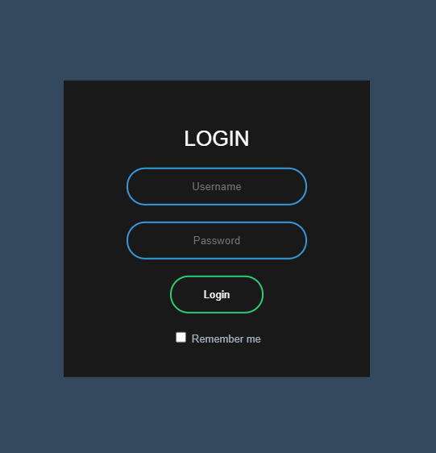

# LoginScreenHTML
<!DOCTYPE html>
<html>
    <body>
        

            Just a test of HTML and CSS, nothing special to see here.
        

        

            Preview:
             
            
        

    </body>
</html>
